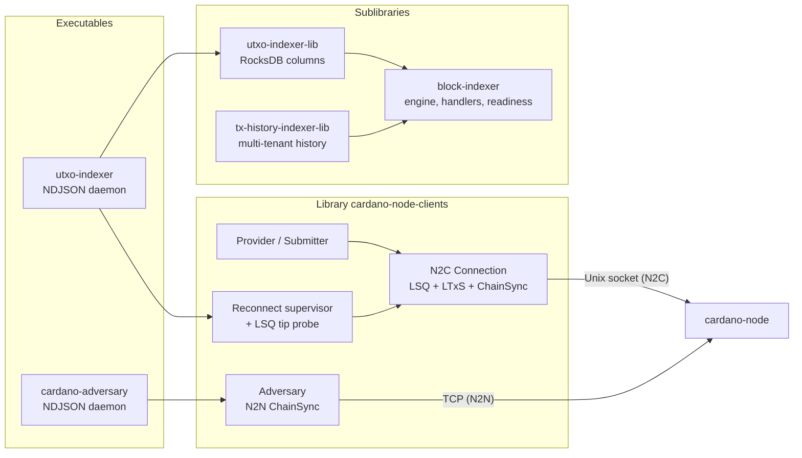

# cardano-node-clients

Haskell clients for Cardano node mini-protocols (N2C + N2N).

## What is this

`cardano-node-clients` is a Haskell library plus two daemons for talking
to a Cardano node over the Ouroboros mini-protocols. The library is
channel-driven: callers enqueue requests into STM channels and the
protocol clients drain them against the node, decoupling application
code from the protocol state machines.

On the Node-to-Client (N2C) side it provides LocalStateQuery,
LocalTxSubmission, and ChainSync clients over the node's Unix socket,
wrapped in high-level `Provider` (ledger queries: UTxOs, protocol
parameters, stake rewards, governance state, treasury, slot/time
conversion) and `Submitter` (signed Conway transaction submission)
record-of-functions interfaces. A reconnect supervisor with an LSQ
tip probe keeps long-running chain followers alive across node
restarts.

On top of the ChainSync client sit three indexer components: a generic
`block-indexer` engine (rollback log, handler composition, readiness),
an address-keyed UTxO indexer (in-memory or RocksDB-backed, shipped
as the `utxo-indexer` daemon with an NDJSON Unix-socket read API), and
a multi-tenant `tx-history-indexer` that records transaction summaries
with direction. On the Node-to-Node (N2N) side, the `cardano-adversary`
daemon opens adversarial ChainSync connections against block producers
for fault-injection testing (e.g. under Antithesis).

Transaction building, balancing, blueprint-aware diffing, and the
`tx-diff` / `cardano-tx-generator` executables live in
[lambdasistemi/cardano-tx-tools](https://github.com/lambdasistemi/cardano-tx-tools).

## Architecture



## Install

Released `utxo-indexer` builds for x86_64 Linux (AppImage, deb, rpm)
are attached to the
[GitHub releases](https://github.com/lambdasistemi/cardano-node-clients/releases).

With Nix, run the executables straight from the flake:

```bash
nix run github:lambdasistemi/cardano-node-clients              # utxo-indexer
nix run github:lambdasistemi/cardano-node-clients#cardano-adversary
```

## Quickstart

Index a node's UTxO set and query it over NDJSON:

```bash
utxo-indexer \
  --relay-socket /run/cardano-node/node.socket \
  --listen /tmp/utxo-indexer.sock \
  --network-magic 764824073 \
  --byron-epoch-slots 21600 &

printf '{"ready": null}\n' | nc -U /tmp/utxo-indexer.sock
```

`--network-magic` / `--byron-epoch-slots` are `764824073` / `21600` on
mainnet, `1` / `21600` on preprod, `2` / `21600` on preview.

## Usage

### Executables

- [`utxo-indexer`](app/utxo-indexer/) — address→UTxO indexer daemon
  (in-memory or RocksDB-backed via `--db-path`) exposing `ready`,
  `utxos_at`, and `await` over a Unix-socket NDJSON wire. Survives
  upstream-relay restarts via an in-process reconnect supervisor with
  full-jitter exponential backoff, gated by an LSQ tip probe (issue
  [#97](https://github.com/lambdasistemi/cardano-node-clients/issues/97)).
- `cardano-adversary` — N2N adversary daemon for fault-injection
  testing. Serves `ready` and `chain_sync_flap` (open N concurrent
  adversarial ChainSync connections against the configured producers,
  pull a bounded number of blocks from randomised chain points, then
  disconnect) over a Unix-socket NDJSON control wire.

### Library

```haskell
import Cardano.Node.Client.N2C.Connection
import Cardano.Node.Client.N2C.Provider
import Cardano.Node.Client.N2C.Submitter
import Control.Concurrent.Async (async)
import Ouroboros.Network.Magic (NetworkMagic (..))

main :: IO ()
main = do
    lsqCh  <- newLSQChannel 16
    ltxsCh <- newLTxSChannel 16
    -- connect in background
    _ <- async $
        runNodeClient
            (NetworkMagic 764824073)  -- mainnet
            "/run/cardano-node/node.socket"
            lsqCh
            ltxsCh
    let provider  = mkN2CProvider lsqCh
        submitter = mkN2CSubmitter ltxsCh
    -- use provider / submitter ...
    pure ()
```

### Library components

- `cardano-node-clients` — N2C clients, `Provider` / `Submitter`,
  reconnect supervisor, the N2N adversary modules, and the bundled
  UTxO indexer follower/daemon/server surface.
- `cardano-node-clients:block-indexer` — generic rollback-log,
  handler-composition, and readiness helpers. No dependency on UTxO
  columns or the node transport.
- `cardano-node-clients:utxo-indexer-lib` — concrete UTxO storage
  columns over `kv-transactions` (RocksDB or in-memory) and the
  indexer state machine.
- `cardano-node-clients:tx-history-indexer-lib` — multi-tenant
  transaction-history storage with direction-aware summaries.
- `cardano-node-clients:devnet` — `withCardanoNode` /
  `withRestartableCardanoNode` helpers that run a real `cardano-node`
  subprocess for E2E tests.

## Documentation

Full documentation:
**<https://lambdasistemi.github.io/cardano-node-clients/>**

For AI agents, start at [AGENTS.md](AGENTS.md).

## Development

```bash
nix develop -c just build   # compile library + executables (-O0)
nix develop -c just unit    # unit tests
nix develop -c just e2e     # E2E tests against a real devnet node
nix develop -c just ci      # build + unit + format/lint checks
nix develop -c just serve-docs  # local mkdocs preview
```

Unit tests cover the N2C probe and trace surface, the UTxO indexer
(block extraction, daemon, follower, indexer, persistence, provider,
server, shared follower, types, mainnet smoke), the tx-history
indexer (indexing and history rollback), the block-indexer handler,
the adversary chain-points parser and server, address parsing, and
validity helpers. E2E tests run a real devnet node for ChainSync,
horizon-aware validity, provider queries, the full N2C session, the
UTxO indexer relay-restart reconnect scenario, and the issue #97
reproduction.

## License

[Apache-2.0](LICENSE)
