# Architecture

## Design

The package separates **protocol-agnostic interfaces** from
**protocol-specific implementations**, and layers indexers on top of a
single ChainSync subscription.

```mermaid
flowchart TB
    subgraph main["cardano-node-clients (main library)"]
        TYPES["Types — Block, BlockPoint"]
        LEDGER["Ledger — ConwayTx alias"]
        PROVIDER["Provider — query record-of-functions"]
        SUBMITTER["Submitter — submit record-of-functions"]
        VALIDITY["Validity — horizon-aware bounds"]
        ADDRESS["Address — credential helpers"]
        subgraph n2c["N2C"]
            N2CTYPES["Types — LSQChannel, LTxSChannel"]
            CODECS["Codecs — codec config + ChainSync codec"]
            CONNECTION["Connection — runNodeClient(Full)"]
            LSQ["LocalStateQuery client"]
            LTXS["LocalTxSubmission client"]
            CHAINSYNC["ChainSync client"]
            PROBE["Probe — LSQ tip readiness"]
            RECONNECT["Reconnect — retry supervisor"]
            TRACE["Trace — N2CEvent"]
            N2CPROVIDER["N2C.Provider — mkN2CProvider"]
            N2CSUBMITTER["N2C.Submitter — mkN2CSubmitter"]
        end
        subgraph adv["Adversary (N2N)"]
            ADVDAEMON["Daemon + Server"]
            ADVAPP["Application — chain_sync_flap"]
            ADVCONN["ChainSync.Connection (N2N)"]
        end
        UTXODAEMON["UTxOIndexer.Daemon / Follower / Server"]
    end

    subgraph bi["block-indexer"]
        ENGINE["Engine — rollback-log engine"]
        HANDLER["Handler — composable handlers"]
        READINESS["Readiness — lag + ready decisions"]
    end

    subgraph uil["utxo-indexer-lib"]
        UCOLUMNS["Columns — TxIn/AddressIndex/Rollback"]
        UINDEXER["Indexer — apply/rollback/await"]
    end

    subgraph thi["tx-history-indexer-lib"]
        TCOLUMNS["Columns — composite key codec"]
        TINDEXER["Indexer — multi-tenant history"]
    end

    PROVIDER --> N2CPROVIDER
    SUBMITTER --> N2CSUBMITTER
    N2CPROVIDER --> LSQ
    N2CSUBMITTER --> LTXS
    PROVIDER --> VALIDITY
    LSQ --> CONNECTION
    LTXS --> CONNECTION
    CHAINSYNC --> CODECS
    RECONNECT --> PROBE
    RECONNECT --> CHAINSYNC
    UTXODAEMON --> RECONNECT
    UTXODAEMON --> UINDEXER
    UINDEXER --> UCOLUMNS
    UINDEXER --> ENGINE
    TINDEXER --> ENGINE
    ENGINE --> HANDLER
    ADVDAEMON --> ADVAPP
    ADVAPP --> ADVCONN
```



## Channel-driven protocol clients

Each N2C mini-protocol client is driven by an STM channel
(`TBQueue`). Callers enqueue a request and block on a `TMVar` for the
result. This decouples request submission from the Ouroboros protocol
loop.

```
                  ┌───────────────┐
  caller ──req──► │   TBQueue     │ ──► protocol client ──► node
  caller ◄─res──  │   TMVar       │ ◄── protocol client ◄── node
                  └───────────────┘
```

The **LocalStateQuery** client batches queries: it waits for the
first query, acquires the volatile tip, drains the queue in a single
acquired session, then releases and loops. Explicit acquired sessions
(`withAcquired`) begin from their own acquire so a group of related
reads share one ledger snapshot.

## N2C connection

`runNodeClient` opens a Unix socket to the Cardano node and
multiplexes two mini-protocols:

- **MiniProtocol 6** — LocalTxSubmission
- **MiniProtocol 7** — LocalStateQuery

`runNodeClientFull` adds **MiniProtocol 5** — ChainSync — on the same
mux session, for processes (like the bundled indexer or the
`cardano-tx-generator` daemon) that need more than one of
{ChainSync, LSQ, LTxS} over a single physical connection.

Both helpers negotiate `NodeToClientV_23` and block until the
connection is closed — run them in a background thread with `async`.

## Reconnect supervisor

Long-running chain followers must survive upstream-relay restarts.
`Cardano.Node.Client.N2C.Reconnect` wraps a single ChainSync run in an
indefinitely-retrying supervisor over `Control.Retry` with full-jitter
exponential backoff (defaults 1 s → 30 s, healthy-run reset at 30 s).

Before the first attempt — and because `cardano-node` binds its socket
*before* its ChainDB finishes loading — the supervisor calls
`Cardano.Node.Client.N2C.Probe.waitForNodeReady`, which opens an
LSQ-only connection and polls the tip until it is non-Origin. Only then
is ChainSync attached, avoiding the `intersectNotFound` trap against a
node still replaying its chain.

## Indexers

The indexer stack is split so consumers depend only on what they need:

- `block-indexer` owns domain-neutral concerns: the rollback-log
  watermark, restoration/following phase threading, rollback pruning,
  replay/conflict classification, and readiness/lag math. It has no
  dependency on UTxO columns or the node transport.
- `utxo-indexer-lib` defines the concrete `kv-transactions` columns
  (a `TxIn → Address` primary table, an `AddressIndex` secondary index
  for prefix snapshot queries, and a slot-keyed `RollbackCol` inverse
  log) and the apply/rollback/await state machine.
- `tx-history-indexer-lib` records direction-aware transaction
  summaries under a composite `(tenant, scope, slot, txid, role)` key
  whose on-disk byte form preserves that ordering.

The bundled `utxo-indexer` daemon glues the chain-sync follower (over
the reconnect supervisor) to an `IndexerHandle` and the NDJSON server.
The follower is exposed as a standalone `withChainSyncFollower`
resource so downstream consumers can run it against a caller-owned
handle without the socket server.

## Transaction building

Transaction building, balancing, blueprint-aware diffing, and the
`tx-diff` / `cardano-tx-generator` executables were moved out of this
repository to
[lambdasistemi/cardano-tx-tools](https://github.com/lambdasistemi/cardano-tx-tools).
The E2E tests here depend on `cardano-tx-tools` for the balancing and
tx-build helpers they exercise.
