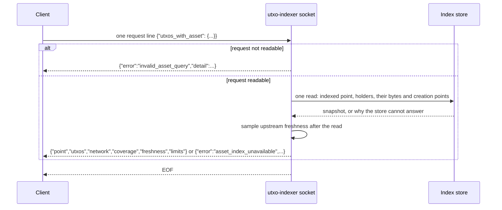
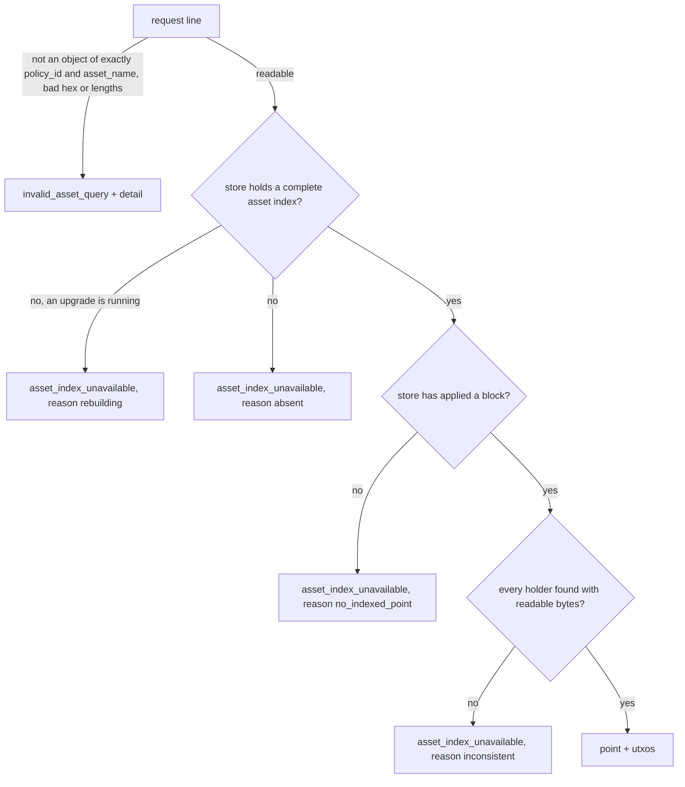
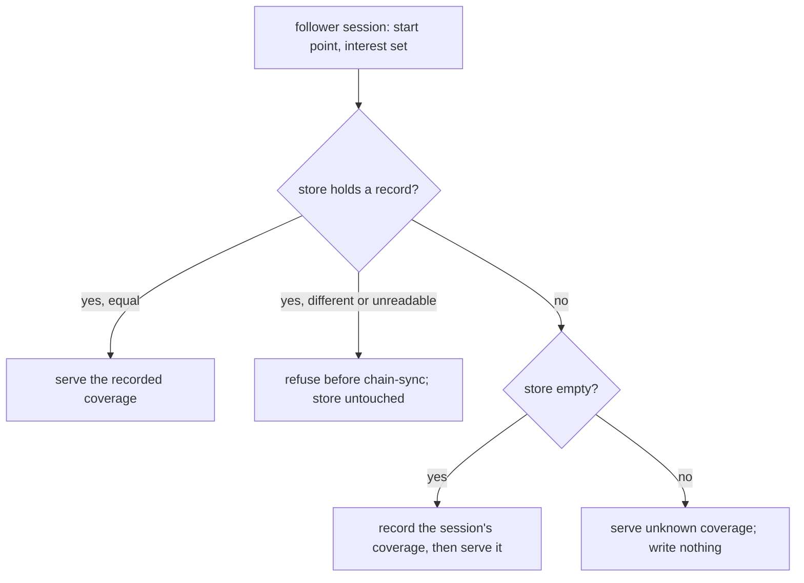
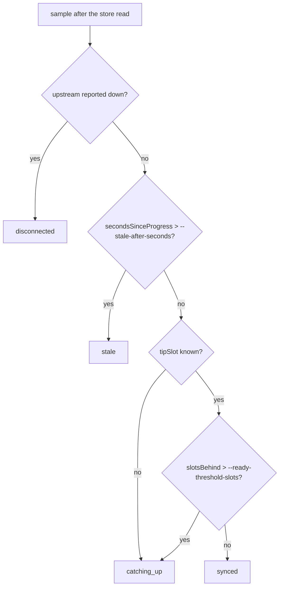
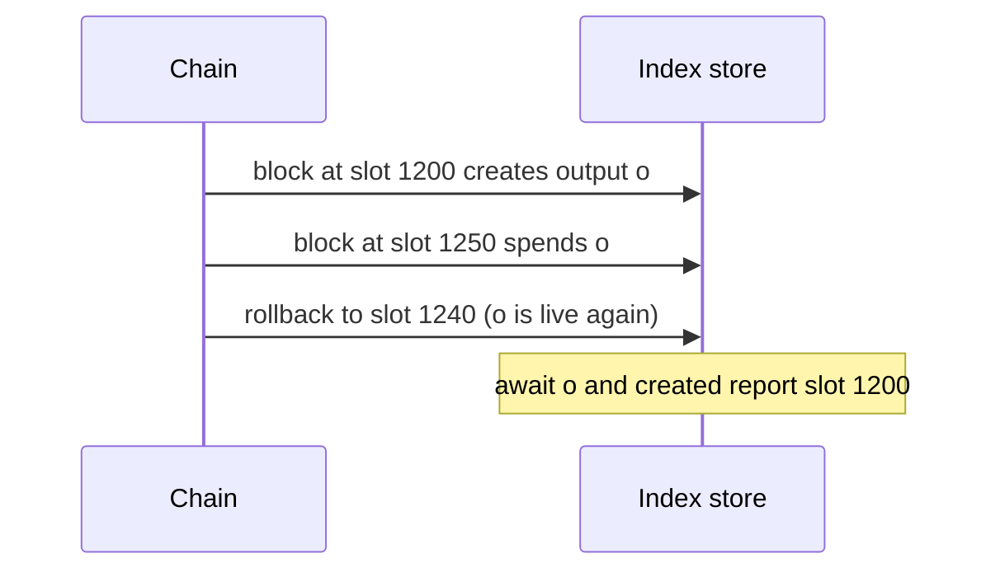
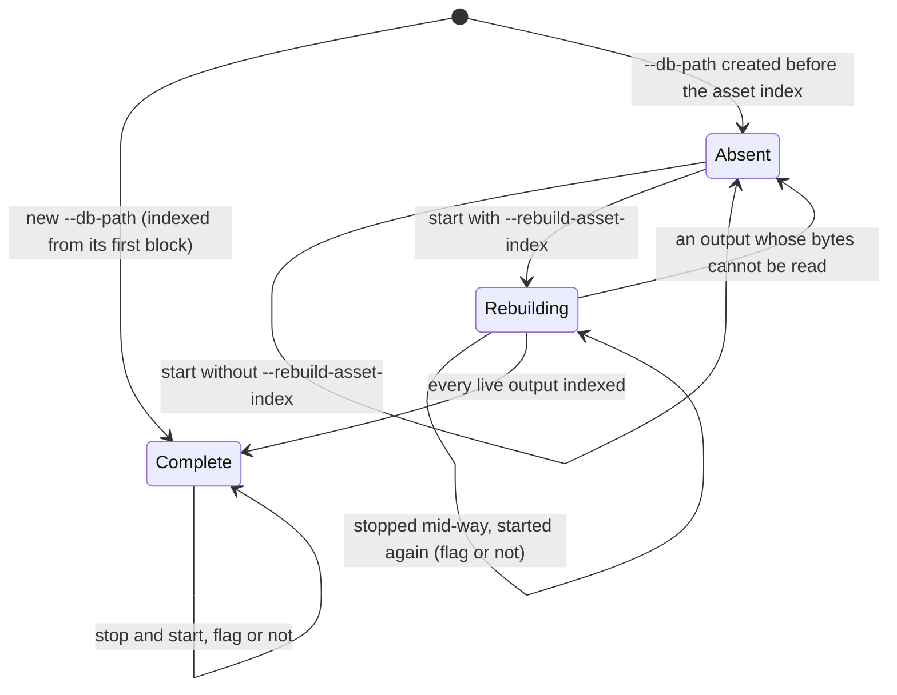
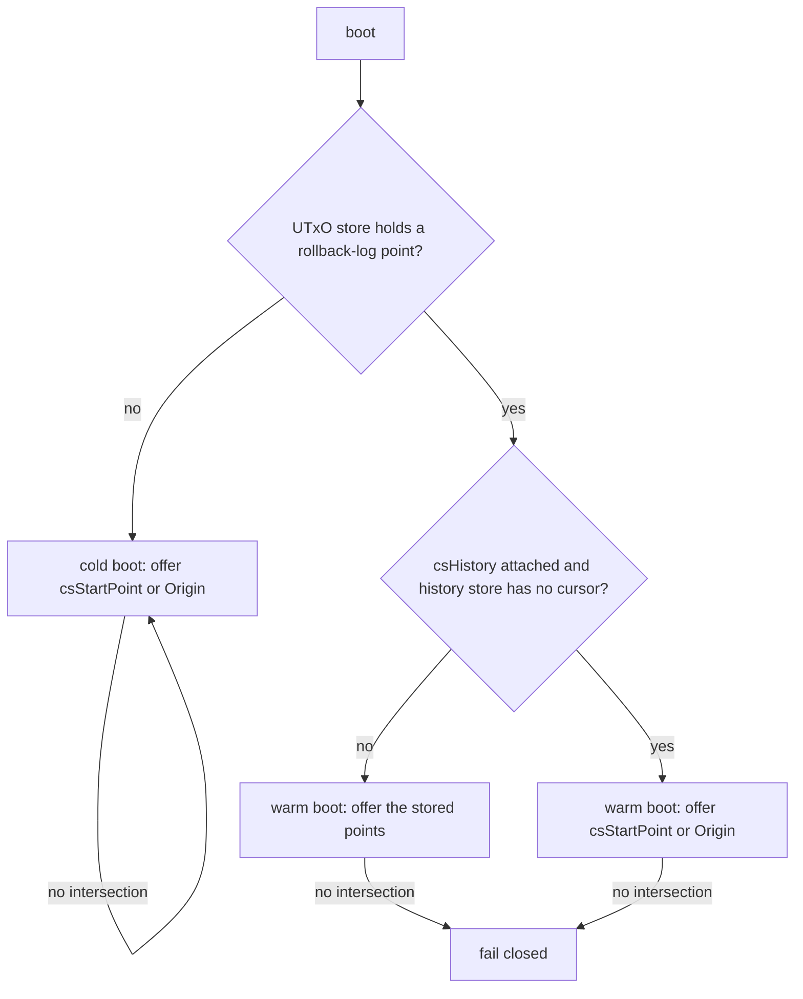

# utxo-indexer

In-process address→UTxO indexer daemon. Follows the chain via
Node-to-Client (N2C) ChainSync from a single Cardano relay, maintains
an indexed view (in-memory or RocksDB-backed), and exposes four read
primitives over a Unix-domain NDJSON socket: `ready`,
`utxos_at <addr>`, `await <txin> [timeout_seconds]`, and
`utxos_with_asset <policy_id> <asset_name>`.

## CLI

```bash
utxo-indexer \
  --relay-socket   /path/to/cardano-node/node.sock \
  --listen         /tmp/idx.sock \
  --network-magic  42 \
  --byron-epoch-slots 86400 \
  [--ready-threshold-slots 60] \
  [--security-param-k 2160] \
  [--db-path        /tmp/idx-db] \
  [--reconnect-initial-ms          1000] \
  [--reconnect-max-ms              30000] \
  [--reconnect-reset-threshold-ms  30000] \
  [--node-ready-timeout-ms         <ms>] \
  [--stale-after-seconds           600] \
  [--rebuild-asset-index]
```

| Flag | Default | Purpose |
|------|---------|---------|
| `--relay-socket` | — | Unix socket of the upstream cardano-node relay. |
| `--listen` | — | Path the indexer will bind for NDJSON consumers. |
| `--network-magic` | — | Cardano network magic (mainnet=764824073, preprod=1, preview=2, antithesis testnet=42). |
| `--byron-epoch-slots` | — | Byron-era epoch length (mainnet=21600, antithesis testnet=86400). |
| `--ready-threshold-slots` | `60` | `slotsBehind ≤ this ⇒ ready=true`. |
| `--security-param-k` | `2160` | Cardano security parameter k; caps the rollback log. |
| `--db-path` | (in-memory) | If set, RocksDB at this path. State survives process restart. |
| `--reconnect-initial-ms` | `1000` | Base of the supervisor's full-jitter exponential backoff. |
| `--reconnect-max-ms` | `30000` | Cap of the supervisor's backoff window. |
| `--reconnect-reset-threshold-ms` | `30000` | Healthy-run duration that resets the supervisor's failure counter. |
| `--node-ready-timeout-ms` | unset | Total cap on the LSQ tip probe. **Unset = wait forever** for the upstream node's ChainDB to load. Set explicitly for CI scenarios that want to fail fast. |
| `--stale-after-seconds` | `600` | Seconds without follower progress after which a connected upstream makes asset answers `stale` (see [Network, coverage and freshness](#network-coverage-and-freshness)). A positive whole number; anything else is a usage error. |
| `--rebuild-asset-index` | off | Add the asset index in place to a RocksDB store that has none, from the outputs it already holds, while the daemon serves (see [Restart and upgrade](#restart-and-upgrade)). Takes no value. On a store whose index is complete, a new store or the in-memory backend it changes nothing. |

All flags are parsed by `parseDaemonArgs` in
`Cardano.Node.Client.UTxOIndexer.Daemon`; required flags are
`--relay-socket`, `--listen`, `--network-magic`, and
`--byron-epoch-slots`.

## Read wire (NDJSON)

One request line per connection, one response line, then EOF:

```
REQ:  {"ready": null}
RESP: {"ready":<bool>, "tipSlot":<int|null>,
       "processedSlot":<int|null>, "slotsBehind":<int|null>, ...}

REQ:  {"utxos_at": "<hex-of-address-bytes>"}
RESP: {"utxos": [{"txin":"<txid>#<ix>", "txout":"<base16-cbor>"}, ...]}

REQ:  {"await": "<txid_hex>#<ix>"}            # optional "timeout_seconds": <int>
RESP: {"slot":<int>, "blockHash":"<hex>", "txout":"<base16-cbor>"}
    | {"timeout": true}

REQ:  {"utxos_with_asset": {"policy_id": "<56 hex>", "asset_name": "<0..64 hex>"}}
RESP: see "Holders of a native asset" below
```

Address bytes go on the wire as hex; bech32 parsing lives in the
consumer. On upstream disconnect the `ready` response carries an
`upstream` object naming the reason, attempt counter, and
elapsed-since-disconnect time, while `utxos_at`, `await` and
`utxos_with_asset` continue to be served from cached state. A line no
request accepts is answered `{"error":"malformed json"}`.

## Holders of a native asset

You hold a policy ID and an asset name, and you want every live output
that carries that asset: where it is, how much of the asset it holds,
its exact ledger bytes, its datum, and the block that created it — all
read at one point of the chain. `utxos_with_asset` answers exactly
that, or tells you explicitly why it cannot; it never answers a
partial list.



### Request

```json
{"utxos_with_asset": {"policy_id": "<56 hex digits>", "asset_name": "<0 to 64 hex digits>"}}
```

- `policy_id` is the 28-byte policy ID as hex.
- `asset_name` is the raw asset name, 0 to 32 bytes, as hex. Names are
  bytes, not text: the empty name (`""`) and names that are not UTF-8
  are valid and distinct.
- Hex is read in any case; every hex value the daemon writes is lower
  case.
- The object carries exactly these two fields. Any other field inside
  it is refused rather than ignored, so a field this daemon does not
  understand never silently changes the question.
- Send one request per line. A line that also carries a well-formed
  `utxos_at`, `ready` or `await` request is answered as that request.

### Run it

With the daemon listening on `/tmp/idx.sock` (`--listen /tmp/idx.sock`):

```bash
printf '%s\n' '{"utxos_with_asset":{"policy_id":"1f6b3ad2a4c9e8d7b6f5a4938271605f4e3d2c1b0a99887766554433","asset_name":"746f6b656e"}}' \
  | socat - UNIX-CONNECT:/tmp/idx.sock
```

`nc -U /tmp/idx.sock` works the same way in place of `socat`. The
answer is one line; piped through `jq .` it reads:

```json
{
  "coverage": {
    "addresses": "all",
    "start": "origin"
  },
  "freshness": {
    "secondsSinceProgress": 3,
    "slotsBehind": 4,
    "status": "synced",
    "tipSlot": 1294
  },
  "limits": [],
  "network": {
    "magic": 42
  },
  "point": {
    "blockHash": "c0ffee00c0ffee00c0ffee00c0ffee00c0ffee00c0ffee00c0ffee00c0ffee00",
    "slot": 1290
  },
  "utxos": [
    {
      "created": {
        "blockHash": "6b1f4c2e9a8d7c6b5a4f3e2d1c0b9a8f7e6d5c4b3a2f1e0d9c8b7a6f5e4d3c2b",
        "slot": 1200
      },
      "datum": {
        "kind": "none"
      },
      "quantity": "100",
      "txin": "0d6a2f9e8c7b6a5f4e3d2c1b0a9f8e7d6c5b4a3f2e1d0c9b8a7f6e5d4c3b2a1f#0",
      "txout": "82581d608a1f2e3d4c5b6a79881726354453627180918a7b6c5d4e3f2a1b0c9d821a001e8480a1581c1f6b3ad2a4c9e8d7b6f5a4938271605f4e3d2c1b0a99887766554433a145746f6b656e1864"
    },
    {
      "created": {
        "blockHash": "a3c5e7f9b1d2c4e6f8a0b2d4c6e8f0a2b4d6c8e0f2a4b6d8c0e2f4a6b8d0c2e4",
        "slot": 1234
      },
      "datum": {
        "cbor": "182a",
        "kind": "inline"
      },
      "quantity": "5",
      "txin": "7e41c3a5b2d6f8e0a9c7b5d3f1e2c4a6b8d0e2f4a6c8e0b2d4f6a8c0e2b4d6f8#2",
      "txout": "a300581d603c4d5e6f708192a3b4c5d6e7f8091a2b3c4d5e6f708192a3b4c5d6e701821a002dc6c0a1581c1f6b3ad2a4c9e8d7b6f5a4938271605f4e3d2c1b0a99887766554433a145746f6b656e05028201d81842182a"
    },
    {
      "created": {
        "blockHash": "a3c5e7f9b1d2c4e6f8a0b2d4c6e8f0a2b4d6c8e0f2a4b6d8c0e2f4a6b8d0c2e4",
        "slot": 1234
      },
      "datum": {
        "hash": "5e9d8a7b6c5d4e3f2a1b0c9d8e7f6a5b4c3d2e1f0a9b8c7d6e5f4a3b2c1d0e9f",
        "kind": "hash"
      },
      "quantity": "1",
      "txin": "7e41c3a5b2d6f8e0a9c7b5d3f1e2c4a6b8d0e2f4a6c8e0b2d4f6a8c0e2b4d6f8#3",
      "txout": "83581d603c4d5e6f708192a3b4c5d6e7f8091a2b3c4d5e6f708192a3b4c5d6e7821a002625a0a1581c1f6b3ad2a4c9e8d7b6f5a4938271605f4e3d2c1b0a99887766554433a145746f6b656e0158205e9d8a7b6c5d4e3f2a1b0c9d8e7f6a5b4c3d2e1f0a9b8c7d6e5f4a3b2c1d0e9f"
    }
  ]
}
```

When no live output holds the asset the answer is still a full answer,
with an empty list: `{"point":{...},"utxos":[],...}` and the same
`network`, `coverage`, `freshness` and `limits`. Whether that empty list
is the chain's answer is what `limits` says: see
[Network, coverage and freshness](#network-coverage-and-freshness).

### Fields

| Field | Meaning |
|-------|---------|
| `point.slot`, `point.blockHash` | The newest applied block the answer was read at. Every holder, every byte and every creation point below come from this one read. |
| `utxos` | Every live output holding the asset, in ascending output-reference order (transaction ID bytes, then output index as a number). No first-match, no uniqueness assumption. |
| `utxos[].txin` | The output reference, `<txid hex>#<index>`. |
| `utxos[].txout` | The output's ledger CBOR, byte-identical to what `utxos_at` returns for the same `txin`. |
| `utxos[].quantity` | How much of the asset the output holds, as a decimal string: quantities reach 2^64−1, beyond what JSON numbers carry exactly in many consumers. |
| `utxos[].created.slot`, `utxos[].created.blockHash` | The block that created the output — the same point `await` reports for that `txin`. |
| `utxos[].datum` | The datum, read from the `txout` bytes themselves (next section). |
| `network.magic` | The network magic the daemon's follower connects with (`--network-magic`). |
| `coverage` | What the store covers, as recorded when it was created: `start` (`"origin"`, the `{"slot","blockHash"}` it started from, or `"unknown"`) and `addresses` (`"all"`, `"filtered"`, or `"unknown"`). |
| `freshness` | How current the answer is: `status`, the last observed upstream `tipSlot`, how many slots `point` is `slotsBehind` that tip, and `secondsSinceProgress` of the follower. |
| `limits` | Every reason this answer may differ from the chain-wide answer at `point`. `[]` is the only form that claims the chain's answer. |

### Datum availability

| `datum.kind` | The output carries | Extra field |
|--------------|--------------------|-------------|
| `none` | no datum | — |
| `hash` | only the 32-byte hash of a datum; the datum itself is not in the output and the daemon does not look it up | `hash`: those 32 bytes |
| `inline` | the datum itself | `cbor`: the inline datum's CBOR exactly as it appears inside `txout` (in the sample, `182a` is the tail of the second `txout`) |

The datum view is never made up: if an output's bytes cannot be read,
the query answers `asset_index_unavailable` with `inconsistent` instead.

### Errors



`invalid_asset_query` carries a human-readable `detail`; only the
`error` value is stable. For example:

```text
{"detail":"policy_id must be 28 bytes (56 hex digits), got 4 bytes","error":"invalid_asset_query"}
{"detail":"unknown field limit in utxos_with_asset","error":"invalid_asset_query"}
```

`asset_index_unavailable` carries a stable `reason`:

| `reason` | Meaning | What to do |
|----------|---------|------------|
| `rebuilding` | The daemon is adding the asset index to this store (started with `--rebuild-asset-index`, or continuing an upgrade an earlier run began). `utxos_at`, `ready` and `await` answer as usual meanwhile. | Retry later; the answer turns into the holders once every live output is indexed. See [Restart and upgrade](#restart-and-upgrade). |
| `absent` | The store has no complete asset index: it was created by an earlier version of the daemon, or it met an output it could not read. Such a store keeps answering `utxos_at`, `ready` and `await`. | Restart the daemon on the same `--db-path` with `--rebuild-asset-index` (see [Restart and upgrade](#restart-and-upgrade)). If the answer is `absent` again once that upgrade ends, the store holds an output the daemon cannot read: start it on a new `--db-path`, which indexes assets from its first block. |
| `no_indexed_point` | The store has no point to answer at yet: no block applied, or the daemon is still in its initial catch-up from genesis, which records no rollback points. | Retry once `ready` is `true`. |
| `inconsistent` | An index entry has no matching live output, or an output's bytes cannot be read. | Report it; the store needs rebuilding. |

### Fault checks in CI

Two CI jobs show that the tests guarding this answer fail when the
behaviour they guard breaks, not only when their setup does. Each
builds the asset query from a copy of the source with one fault
patched in (`nix/faults/*.patch`; the shipped daemon and library are
never built with it), runs the one guarding example, and passes only
if that example fails on an expectation.

| Job | Fault | Guarding example |
|-----|-------|------------------|
| `fault-asset-matching` | the index walk keeps a row on its policy alone, so other asset names of the policy are returned | `…asset index/transactional maintenance against the model (I1)/matches after create, move, split, partial spend and burn` |
| `fault-snapshot-binding` | the read runs as separate transactions and waits for the indexed point to move, so the point, the matches and their creation points come from different snapshots | `…asset index/concurrent snapshots (I5)/every snapshot equals the model state at its point` |

Run one locally with `nix run --quiet .#fault-asset-matching` (or
`.#fault-snapshot-binding`). It prints one line:

```text
FAULT-CHECK fault-asset-matching outcome=KILLED example=<hspec path>
```

| Outcome | Exit | Meaning |
|---------|------|---------|
| `KILLED` | 0 | the example failed on an expectation under the fault: the guard works |
| `SURVIVED` | 3 | the example passed under the fault: the guard misses this fault |
| `SETUP-FAILURE:<reason>` | 2 | no verdict: `fault-not-applied` (the patch no longer applies to the source), `example-not-run`, `example-not-unique`, `example-pending`, `failed-by-exception` (the example failed by an exception, not an expectation), `harness-failed` (the check script itself failed), `usage` (the runner was not given exactly one example) |
| no `FAULT-CHECK` line | 1 | no verdict: nix failed before the check ran, typically a faulted copy that no longer compiles |

The table is itself checked: the `fault-check-runner` check (built by
CI's build gate) drives the check script through every row with a
stub runner, and the unit suite drives the classifier through every
kind of example result; both fail if any outcome exits 1 or gets the
wrong code.

A `fault-not-applied` or no-line failure after a change to
`Indexer.hs` means the patch must be refreshed to the new source; a
`SURVIVED` means the guarding test must be strengthened.

## Network, coverage and freshness

An empty or short `utxos` list can mean two things: the chain holds no
more outputs of the asset at `point`, or this index cannot see them.
Every successful asset answer says which, in the same line:

```json
"network":   {"magic": 42},
"coverage":  {"start": "origin", "addresses": "all"},
"freshness": {"status": "synced", "tipSlot": 1294, "slotsBehind": 4, "secondsSinceProgress": 3},
"limits":    []
```

Read `limits` first. **An empty `limits` is the only answer that claims
to be the chain's answer at `point`.** Every other answer names each
reason it may differ, whether `utxos` is empty or not.

| `limits` entry | Present when | What it means for `utxos` |
|----------------|--------------|---------------------------|
| `coverage_unknown` | `coverage.start` and `coverage.addresses` are `"unknown"` | The store holds no record of how it was built: its start point and its address set are unknown, so holders may be missing for either reason. |
| `address_filter` | `coverage.addresses` is `"filtered"` | Outputs at addresses outside the store's address set were never indexed: holders there are missing. |
| `partial_history` | `coverage.start` is a point, not `"origin"` or `"unknown"` | Outputs created before the start point were never indexed: holders created earlier are missing. |
| `catching_up` | `freshness.status` is `catching_up` | `point` is behind the upstream tip: later creations and spends are not reflected yet. |
| `disconnected` | `freshness.status` is `disconnected` | The upstream node is unreachable: the answer comes from the cached store, and how far the chain has moved since is unknown. |
| `stale` | `freshness.status` is `stale` | The upstream is connected but the follower has made no progress for longer than `--stale-after-seconds`. |

Entries appear in that order, each at most once. The two error answers
(`invalid_asset_query`, `asset_index_unavailable`) carry none of these
members and are unchanged.

### Network

`network.magic` is the network magic the daemon's follower connects
with, the `--network-magic` it was started with. The follower's
handshake with the node fails on any other magic, so a daemon that is
following a node is on that node's network.

### Coverage

`coverage` is the coverage the **store** was built with, recorded in
the store when it was created — not the configuration of the process
serving it:

| Member | Values | From |
|--------|--------|------|
| `start` | `"origin"`, `{"slot": <int>, "blockHash": "<hex>"}`, or `"unknown"` | the recorded start point (none means origin) |
| `addresses` | `"all"`, `"filtered"`, or `"unknown"` | the recorded interest set: every address, or an address set |

What is recorded, and when:

- The first follower session over an **empty** store (no live output,
  no rollback-log entry) records its start point and its interest set,
  including the full address set, before chain-sync starts. The record
  is written once and never changed.
- A later session whose start point or interest set differs — a start
  point added, removed or moved, `"all"` against a set, or one address
  set against another — is **refused** before chain-sync starts, with
  an error (`BuildCoverageRefusal`) naming the recorded and the
  requested coverage. The store is left untouched; reopen it with the
  configuration it was built with, or build a new store. A record that
  cannot be read is refused the same way and kept as it is.
- A store that already held blocks when coverage started being
  recorded has no record, and none is ever written into it: its
  coverage cannot be known. It is served with `start` and `addresses`
  both `"unknown"` and the `coverage_unknown` limit, whatever the
  serving configuration. The same holds for a store still opened with
  only the four pre-asset column families.



The bundled `utxo-indexer` binary always follows from origin over every
address: a store it creates answers
`{"start":"origin","addresses":"all"}`. The other values come from
in-process followers built with a start point or an address set (see
[Embedded use](#embedded-use)).

### Freshness

`freshness` is sampled once per answer, **after** the store read that
produced `point` and `utxos`, and measured against that `point`:

| Member | Meaning |
|--------|---------|
| `status` | `synced`, `catching_up`, `disconnected` or `stale` (rules below). |
| `tipSlot` | The last upstream tip slot the follower observed; `null` before the first block. |
| `slotsBehind` | `tipSlot − point.slot`, clamped at 0; `null` when `tipSlot` is `null`. It is computed from this answer's `point`, not from the follower's latest processed slot, so it says how far *this answer* is behind. |
| `secondsSinceProgress` | Whole seconds since the follower last made progress: applied a block, or saw its upstream connect or disconnect. |

The status is the first rule that holds:



- `disconnected` beats everything: the reconnect supervisor reports the
  upstream down, the same state `ready` shows as its `upstream` object.
- `stale` uses wall-clock time since the last progress, not slot
  arithmetic, so it needs no genesis parameters. A chain that produces
  no block for longer than the bound also reads as `stale`; choose the
  bound well above the network's longest normal block gap.
- `catching_up` uses the same threshold as `ready`
  (`--ready-threshold-slots`): an answer at most that many slots behind
  the tip is `synced`.
- A daemon started with no node behind its relay socket answers
  `catching_up` (no tip yet) until the stale bound passes, then `stale`.

### Rollbacks

`limits: []` means the answer is the chain's answer **at `point`**, not
that `point` is final. A block within the last `k` blocks
(`--security-param-k`) can still be rolled back; after a rollback the
same query may answer at an earlier `point` with different holders, and
`created` points of outputs brought back follow
[`await` after a rollback](#await-after-a-rollback). A client that
needs settled holders compares `point.slot` with how deep it requires
the block to be.

## `await` after a rollback

A rollback can bring back an output that a rolled-back block had spent.
For such an output, `await` (and the asset query's `created`) report the
block that originally created it — not the block that was rolled back:



Rollback history recorded by earlier versions of the daemon carries no
creation point: an output brought back by such an entry reports the
rolled-back block, as before. Every other `await` answer is unchanged.

## Reconnect behaviour (issue #97)

The daemon survives upstream relay disconnects (e.g. relay container
restart) without exiting:

- the listen socket keeps accepting consumer connections;
- `ready` returns `ready=false` with the `upstream` reason while
  disconnected;
- `utxos_at` and `await` keep serving cached state — consumer
  connections are never EOFed because of an upstream disconnect;
- before each reconnect attempt the supervisor probes the relay via
  LocalStateQuery (acquire volatile tip + read tip); ChainSync is
  attached only once the probe sees a non-Origin tip;
- reconnect retries use full-jitter exponential backoff (defaults
  1 s → 30 s) via `Control.Retry`.

Operators no longer need orchestrator-level `restart: always` on the
indexer container to recover from peer flapping.

## Restart and upgrade

You run the daemon on a RocksDB `--db-path` and stop it for a deploy, a
host reboot or a new binary. When it comes back on the same directory
you want the same answers, including `utxos_with_asset`. If the
directory was created by a daemon that predates the asset index, you
want to add the index in place. You don't want to resync the chain
into a new directory or get a wrong list in the meantime.



### Restart

Stop the daemon and start it on the same `--db-path`. It resumes the
chain from the newest block the store recorded and answers
`utxos_with_asset` with the same holders, bytes, quantities and
creation points as before the stop. It then follows the chain on from
there. Nothing has to be rebuilt.

This holds once the daemon has applied a block within k slots of the
chain tip (k is `--security-param-k`): from then on the store records
the points it resumes from. A daemon stopped earlier, during its initial
catch-up from genesis, has recorded none. On restart it starts the
chain again from genesis, over the blocks it already holds.

If the node's chain no longer includes any of the stored points, the
daemon refuses to resume rather than replay from genesis over the
store; [When `csStartPoint` is consulted](#when-csstartpoint-is-consulted)
names the two ways this happens and how to recover.

### Upgrading a store created before the asset index

A store written by a daemon that predates the asset index answers
`utxos_with_asset` with `asset_index_unavailable`, reason `absent`, and
keeps serving everything else. To add the index in place:

1. Stop the daemon and keep a copy of the directory. The upgrade is
   one-way from the moment it starts: the first start with the flag
   adds the asset index's column families, and from then on a binary
   that predates the index cannot open the store, even if the upgrade
   is stopped before it completes. The copy is your way back.

   ```bash
   cp -a /var/lib/utxo-indexer /var/lib/utxo-indexer.before-asset-index
   ```

2. Start the daemon on the same directory with `--rebuild-asset-index`:

   ```bash
   utxo-indexer \
     --relay-socket /path/to/cardano-node/node.sock \
     --listen /tmp/idx.sock \
     --network-magic 764824073 \
     --byron-epoch-slots 21600 \
     --db-path /var/lib/utxo-indexer \
     --rebuild-asset-index
   ```

The daemon builds the index from the outputs the store already holds,
while it follows the chain and serves the socket:

| Request | While the index is being built |
|---------|-------------------------------|
| `utxos_at` | Answered as usual, byte for byte. |
| `await` | Answered as usual. |
| `ready` | Answered as usual; the daemon keeps following the chain. |
| `utxos_with_asset` | `asset_index_unavailable`, reason `rebuilding`, until every live output is indexed. After that, the holders. It never answers a partial list. |

- **Stopped mid-way?** The next start continues the upgrade from where
  it stopped, with or without the flag. One exception: a daemon stopped
  while it was adding the column families, before the upgrade began,
  leaves a store that opens as `absent` without the flag; start it with
  the flag again and the upgrade continues.
- **Leaving the flag on is harmless.** On a store whose index is
  complete, or on a new store, it changes nothing. The in-memory
  backend (no `--db-path`) ignores it.
- **An output the daemon cannot read** ends the upgrade without an
  index, and the answer goes back to `absent`. The store keeps
  serving `utxos_at`, `ready` and `await`. Start the daemon on a new
  `--db-path` to get the asset query.

## Stderr trace stream

Every lifecycle transition emits one line on stderr:

```
2026-04-30T12:34:56.789Z INFO indexer event=started        socketPath=... dbPath=...
2026-04-30T12:35:42.103Z INFO indexer event=disconnected   reason=bearer-closed
2026-04-30T12:35:42.380Z INFO indexer event=node-replaying attempt=1 elapsedMs=275
2026-04-30T12:35:43.500Z INFO indexer event=reconnecting   attempt=1 waitMs=312
2026-04-30T12:35:44.815Z INFO indexer event=reconnected    resumeSlot=12345 elapsedMs=2712
2026-04-30T12:40:00.001Z INFO indexer event=stopped        reason=normal
```

`grep '^.*indexer '` is the operator-friendly filter. Counting
`event=disconnected` vs `event=reconnected` per peer-restart cycle is
the recommended fault-injection assertion; `event=node-replaying`
lines reveal that the upstream relay is alive but its ChainDB hasn't
finished loading.

## Embedded use

Embedders that want to route `N2CEvent`s into their own tracer can
pass a custom `Tracer IO N2CEvent` to
`Cardano.Node.Client.UTxOIndexer.Daemon.runDaemon`'s first argument
instead of `defaultStderrTracer`. To own the `IndexerHandle` (RocksDB
is single-writer) and run the follower without the NDJSON server, use
`Cardano.Node.Client.UTxOIndexer.Follower.withChainSyncFollower`. The
`cardano-tx-generator` daemon in
[lambdasistemi/cardano-tx-tools](https://github.com/lambdasistemi/cardano-tx-tools)
embeds the indexer this way.

### Read several queries at one indexed point

`IndexerHandle.readView` accepts a `NonEmpty ReadQuery` and returns
`IO (Either AssetQueryUnavailable IndexedView)`. Use `AddressQuery address`
for an address's live outputs and `AssetQuery policyId assetName` for an
asset's live holders:

```haskell
readView handle
    (AddressQuery address :| [AssetQuery policyId assetName, AddressQuery address])
```

Import `NonEmpty(..)` from `Data.List.NonEmpty` and the view types from
`Cardano.Node.Client.UTxOIndexer.Indexer`. On success, `ivPoint` is the
indexed `(SlotNo, BlockHash)` shared by every answer in `ivResults`.
Results preserve query order and duplicates: an `AddressQuery` produces
`AddressResult [(TxIn, TxOut)]`, and an `AssetQuery` produces
`AssetResult [AssetMatch]`. Each list is ascending by `TxIn`; asset matches
retain the stored output bytes, quantity and original creation point,
including after rollback.

Availability, point, results and provenance come from one storage
transaction: one RocksDB snapshot or one in-memory state read. The view is
materialized; traversing it cannot reread storage, and it stays valid after
further apply/rollback operations or after the indexer closes. It reads the
current indexed state; it does not acquire a requested historical point.

An empty or restoration-only store returns `Left NoIndexedPoint`. An
absent, incomplete or degraded asset index returns `Left AssetIndexAbsent`,
and a rebuilding index returns `Left AssetIndexRebuilding`. A requested
asset row missing live data returns `Left (AssetIndexInconsistent txIn)`.
These errors refuse the whole batch without returning partial results.
**Address-only views also refuse when the asset index is unavailable.**
The existing `snapshotAt` read keeps its signature and behavior and remains
available for ordinary address reads on a degraded store.

### When `csStartPoint` is consulted

`ChainSyncConfig.csStartPoint` is consulted only when the follower has
no usable stored resume point:

1. **cold boot** — the UTxO store holds no rollback-log point
   (`getResumePoints` is empty);
2. **history store without a cursor** — `csHistory` is attached and its
   history store has no cursor yet, so there is no shared resume point
   (`sharedResumePoint` is `Nothing`), even though the UTxO store is
   warm.

In every other case chain-sync resume candidates come from the stores
and `csStartPoint` does not choose them. A store that recorded its
coverage refuses a session whose `csStartPoint` differs from the
recorded one (see [Coverage](#coverage)); a store without a record
ignores it. The bundled daemon sets no start point and
cold-boots from Origin.



A cold boot that finds no intersection retries. A warm boot that finds
none fails closed. When the stored points were offered, two routes lead
there:

| Route | Cause | Recovery |
|---|---|---|
| (a) divergence beyond `k` | the saved chain diverged from the node by more than the security parameter `k` | wipe the DB and rebuild, or restart against a node whose chain still includes one of the saved points |
| (b) store younger than the rollback depth | the store cold-started inside the volatile window, and the chain rolled back past its start point before the store retained `k` blocks | wipe the store (it holds fewer than `k` blocks) and cold-start again from a start point outside the volatile window, at least `k` blocks behind the tip |

Route (b) exists because the intersection point is never delivered as a
roll-forward: it is never applied, so it never becomes a rollback-log
point. A store that has followed more than `k` blocks is immune —
retention keeps `k + 1` points and the oldest is always offered.

When the history store had no cursor, the start point was offered
instead of the stored points, and the node's chain does not include it.
