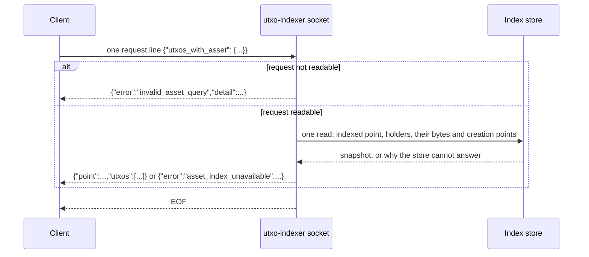
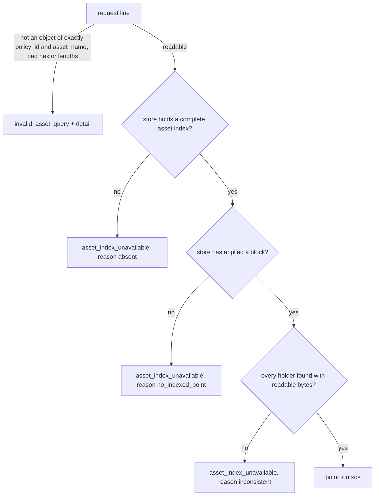
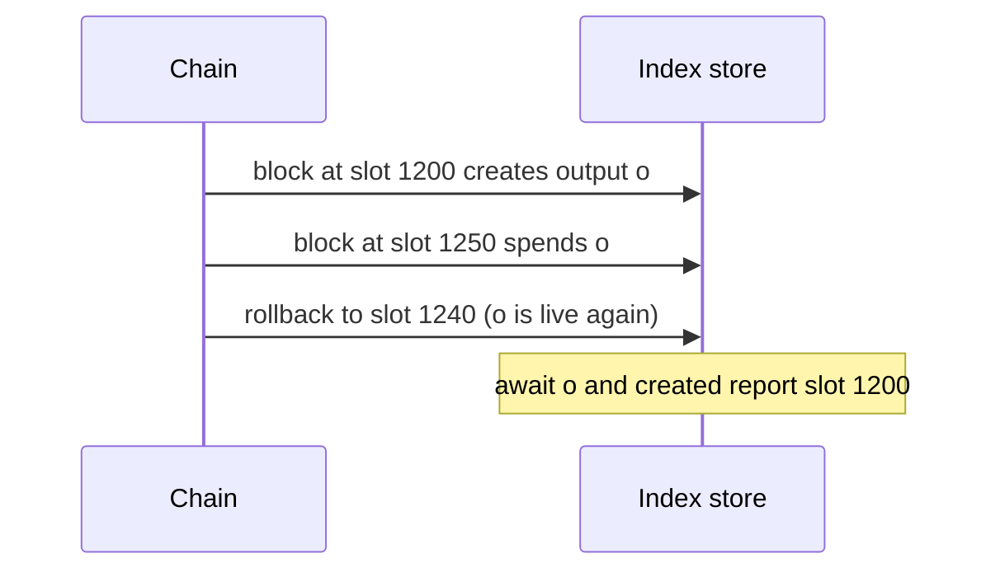

# utxo-indexer

In-process address→UTxO indexer daemon. Follows the chain via
Node-to-Client (N2C) ChainSync from a single Cardano relay, maintains
an indexed view (in-memory or RocksDB-backed), and exposes four read
primitives over a Unix-domain NDJSON socket: `ready`,
`utxos_at <addr>`, `await <txin> [timeout_seconds]`, and
`utxos_with_asset <policy_id> <asset_name>`.

## CLI

```bash
utxo-indexer \
  --relay-socket   /path/to/cardano-node/node.sock \
  --listen         /tmp/idx.sock \
  --network-magic  42 \
  --byron-epoch-slots 86400 \
  [--ready-threshold-slots 60] \
  [--security-param-k 2160] \
  [--db-path        /tmp/idx-db] \
  [--reconnect-initial-ms          1000] \
  [--reconnect-max-ms              30000] \
  [--reconnect-reset-threshold-ms  30000] \
  [--node-ready-timeout-ms         <ms>]
```

| Flag | Default | Purpose |
|------|---------|---------|
| `--relay-socket` | — | Unix socket of the upstream cardano-node relay. |
| `--listen` | — | Path the indexer will bind for NDJSON consumers. |
| `--network-magic` | — | Cardano network magic (mainnet=764824073, preprod=1, preview=2, antithesis testnet=42). |
| `--byron-epoch-slots` | — | Byron-era epoch length (mainnet=21600, antithesis testnet=86400). |
| `--ready-threshold-slots` | `60` | `slotsBehind ≤ this ⇒ ready=true`. |
| `--security-param-k` | `2160` | Cardano security parameter k; caps the rollback log. |
| `--db-path` | (in-memory) | If set, RocksDB at this path. State survives process restart. |
| `--reconnect-initial-ms` | `1000` | Base of the supervisor's full-jitter exponential backoff. |
| `--reconnect-max-ms` | `30000` | Cap of the supervisor's backoff window. |
| `--reconnect-reset-threshold-ms` | `30000` | Healthy-run duration that resets the supervisor's failure counter. |
| `--node-ready-timeout-ms` | unset | Total cap on the LSQ tip probe. **Unset = wait forever** for the upstream node's ChainDB to load. Set explicitly for CI scenarios that want to fail fast. |

All flags are parsed in `app/utxo-indexer/Main.hs`; required flags are
`--relay-socket`, `--listen`, `--network-magic`, and
`--byron-epoch-slots`.

## Read wire (NDJSON)

One request line per connection, one response line, then EOF:

```
REQ:  {"ready": null}
RESP: {"ready":<bool>, "tipSlot":<int|null>,
       "processedSlot":<int|null>, "slotsBehind":<int|null>, ...}

REQ:  {"utxos_at": "<hex-of-address-bytes>"}
RESP: {"utxos": [{"txin":"<txid>#<ix>", "txout":"<base16-cbor>"}, ...]}

REQ:  {"await": "<txid_hex>#<ix>"}            # optional "timeout_seconds": <int>
RESP: {"slot":<int>, "blockHash":"<hex>", "txout":"<base16-cbor>"}
    | {"timeout": true}

REQ:  {"utxos_with_asset": {"policy_id": "<56 hex>", "asset_name": "<0..64 hex>"}}
RESP: see "Holders of a native asset" below
```

Address bytes go on the wire as hex; bech32 parsing lives in the
consumer. On upstream disconnect the `ready` response carries an
`upstream` object naming the reason, attempt counter, and
elapsed-since-disconnect time, while `utxos_at`, `await` and
`utxos_with_asset` continue to be served from cached state. A line no
request accepts is answered `{"error":"malformed json"}`.

## Holders of a native asset

You hold a policy ID and an asset name, and you want every live output
that carries that asset: where it is, how much of the asset it holds,
its exact ledger bytes, its datum, and the block that created it — all
read at one point of the chain. `utxos_with_asset` answers exactly
that, or tells you explicitly why it cannot; it never answers a
partial list.



### Request

```json
{"utxos_with_asset": {"policy_id": "<56 hex digits>", "asset_name": "<0 to 64 hex digits>"}}
```

- `policy_id` is the 28-byte policy ID as hex.
- `asset_name` is the raw asset name, 0 to 32 bytes, as hex. Names are
  bytes, not text: the empty name (`""`) and names that are not UTF-8
  are valid and distinct.
- Hex is read in any case; every hex value the daemon writes is lower
  case.
- The object carries exactly these two fields. Any other field inside
  it is refused rather than ignored, so a field this daemon does not
  understand never silently changes the question.
- Send one request per line. A line that also carries a well-formed
  `utxos_at`, `ready` or `await` request is answered as that request.

### Run it

With the daemon listening on `/tmp/idx.sock` (`--listen /tmp/idx.sock`):

```bash
printf '%s\n' '{"utxos_with_asset":{"policy_id":"1f6b3ad2a4c9e8d7b6f5a4938271605f4e3d2c1b0a99887766554433","asset_name":"746f6b656e"}}' \
  | socat - UNIX-CONNECT:/tmp/idx.sock
```

`nc -U /tmp/idx.sock` works the same way in place of `socat`. The
answer is one line; piped through `jq .` it reads:

```json
{
  "point": {
    "blockHash": "c0ffee00c0ffee00c0ffee00c0ffee00c0ffee00c0ffee00c0ffee00c0ffee00",
    "slot": 1290
  },
  "utxos": [
    {
      "created": {
        "blockHash": "6b1f4c2e9a8d7c6b5a4f3e2d1c0b9a8f7e6d5c4b3a2f1e0d9c8b7a6f5e4d3c2b",
        "slot": 1200
      },
      "datum": {
        "kind": "none"
      },
      "quantity": "100",
      "txin": "0d6a2f9e8c7b6a5f4e3d2c1b0a9f8e7d6c5b4a3f2e1d0c9b8a7f6e5d4c3b2a1f#0",
      "txout": "82581d608a1f2e3d4c5b6a79881726354453627180918a7b6c5d4e3f2a1b0c9d821a001e8480a1581c1f6b3ad2a4c9e8d7b6f5a4938271605f4e3d2c1b0a99887766554433a145746f6b656e1864"
    },
    {
      "created": {
        "blockHash": "a3c5e7f9b1d2c4e6f8a0b2d4c6e8f0a2b4d6c8e0f2a4b6d8c0e2f4a6b8d0c2e4",
        "slot": 1234
      },
      "datum": {
        "cbor": "182a",
        "kind": "inline"
      },
      "quantity": "5",
      "txin": "7e41c3a5b2d6f8e0a9c7b5d3f1e2c4a6b8d0e2f4a6c8e0b2d4f6a8c0e2b4d6f8#2",
      "txout": "a300581d603c4d5e6f708192a3b4c5d6e7f8091a2b3c4d5e6f708192a3b4c5d6e701821a002dc6c0a1581c1f6b3ad2a4c9e8d7b6f5a4938271605f4e3d2c1b0a99887766554433a145746f6b656e05028201d81842182a"
    },
    {
      "created": {
        "blockHash": "a3c5e7f9b1d2c4e6f8a0b2d4c6e8f0a2b4d6c8e0f2a4b6d8c0e2f4a6b8d0c2e4",
        "slot": 1234
      },
      "datum": {
        "hash": "5e9d8a7b6c5d4e3f2a1b0c9d8e7f6a5b4c3d2e1f0a9b8c7d6e5f4a3b2c1d0e9f",
        "kind": "hash"
      },
      "quantity": "1",
      "txin": "7e41c3a5b2d6f8e0a9c7b5d3f1e2c4a6b8d0e2f4a6c8e0b2d4f6a8c0e2b4d6f8#3",
      "txout": "83581d603c4d5e6f708192a3b4c5d6e7f8091a2b3c4d5e6f708192a3b4c5d6e7821a002625a0a1581c1f6b3ad2a4c9e8d7b6f5a4938271605f4e3d2c1b0a99887766554433a145746f6b656e0158205e9d8a7b6c5d4e3f2a1b0c9d8e7f6a5b4c3d2e1f0a9b8c7d6e5f4a3b2c1d0e9f"
    }
  ]
}
```

When no live output holds the asset the answer is still a full answer,
with an empty list: `{"point":{...},"utxos":[]}`.

### Fields

| Field | Meaning |
|-------|---------|
| `point.slot`, `point.blockHash` | The newest applied block the answer was read at. Every holder, every byte and every creation point below come from this one read. |
| `utxos` | Every live output holding the asset, in ascending output-reference order (transaction ID bytes, then output index as a number). No first-match, no uniqueness assumption. |
| `utxos[].txin` | The output reference, `<txid hex>#<index>`. |
| `utxos[].txout` | The output's ledger CBOR, byte-identical to what `utxos_at` returns for the same `txin`. |
| `utxos[].quantity` | How much of the asset the output holds, as a decimal string: quantities reach 2^64−1, beyond what JSON numbers carry exactly in many consumers. |
| `utxos[].created.slot`, `utxos[].created.blockHash` | The block that created the output — the same point `await` reports for that `txin`. |
| `utxos[].datum` | The datum, read from the `txout` bytes themselves (next section). |

### Datum availability

| `datum.kind` | The output carries | Extra field |
|--------------|--------------------|-------------|
| `none` | no datum | — |
| `hash` | only the 32-byte hash of a datum; the datum itself is not in the output and the daemon does not look it up | `hash`: those 32 bytes |
| `inline` | the datum itself | `cbor`: the inline datum's CBOR exactly as it appears inside `txout` (in the sample, `182a` is the tail of the second `txout`) |

The datum view is never made up: if an output's bytes cannot be read,
the query answers `asset_index_unavailable` with `inconsistent` instead.

### Errors



`invalid_asset_query` carries a human-readable `detail`; only the
`error` value is stable. For example:

```text
{"detail":"policy_id must be 28 bytes (56 hex digits), got 4 bytes","error":"invalid_asset_query"}
{"detail":"unknown field limit in utxos_with_asset","error":"invalid_asset_query"}
```

`asset_index_unavailable` carries a stable `reason`:

| `reason` | Meaning | What to do |
|----------|---------|------------|
| `absent` | The store has no complete asset index: it was created by an earlier version of the daemon, or it met an output it could not read. Such a store keeps answering `utxos_at`, `ready` and `await`. | Start the daemon on a new `--db-path`; a store created from empty indexes assets from its first block. |
| `no_indexed_point` | The store has no point to answer at yet: no block applied, or the daemon is still in its initial catch-up from genesis, which records no rollback points. | Retry once `ready` is `true`. |
| `inconsistent` | An index entry has no matching live output, or an output's bytes cannot be read. | Report it; the store needs rebuilding. |

## `await` after a rollback

A rollback can bring back an output that a rolled-back block had spent.
For such an output, `await` (and the asset query's `created`) report the
block that originally created it — not the block that was rolled back:



Rollback history recorded by earlier versions of the daemon carries no
creation point: an output brought back by such an entry reports the
rolled-back block, as before. Every other `await` answer is unchanged.

## Reconnect behaviour (issue #97)

The daemon survives upstream relay disconnects (e.g. relay container
restart) without exiting:

- the listen socket keeps accepting consumer connections;
- `ready` returns `ready=false` with the `upstream` reason while
  disconnected;
- `utxos_at` and `await` keep serving cached state — consumer
  connections are never EOFed because of an upstream disconnect;
- before each reconnect attempt the supervisor probes the relay via
  LocalStateQuery (acquire volatile tip + read tip); ChainSync is
  attached only once the probe sees a non-Origin tip;
- reconnect retries use full-jitter exponential backoff (defaults
  1 s → 30 s) via `Control.Retry`.

Operators no longer need orchestrator-level `restart: always` on the
indexer container to recover from peer flapping.

## Stderr trace stream

Every lifecycle transition emits one line on stderr:

```
2026-04-30T12:34:56.789Z INFO indexer event=started        socketPath=... dbPath=...
2026-04-30T12:35:42.103Z INFO indexer event=disconnected   reason=bearer-closed
2026-04-30T12:35:42.380Z INFO indexer event=node-replaying attempt=1 elapsedMs=275
2026-04-30T12:35:43.500Z INFO indexer event=reconnecting   attempt=1 waitMs=312
2026-04-30T12:35:44.815Z INFO indexer event=reconnected    resumeSlot=12345 elapsedMs=2712
2026-04-30T12:40:00.001Z INFO indexer event=stopped        reason=normal
```

`grep '^.*indexer '` is the operator-friendly filter. Counting
`event=disconnected` vs `event=reconnected` per peer-restart cycle is
the recommended fault-injection assertion; `event=node-replaying`
lines reveal that the upstream relay is alive but its ChainDB hasn't
finished loading.

## Embedded use

Embedders that want to route `N2CEvent`s into their own tracer can
pass a custom `Tracer IO N2CEvent` to
`Cardano.Node.Client.UTxOIndexer.Daemon.runDaemon`'s first argument
instead of `defaultStderrTracer`. To own the `IndexerHandle` (RocksDB
is single-writer) and run the follower without the NDJSON server, use
`Cardano.Node.Client.UTxOIndexer.Follower.withChainSyncFollower`. The
`cardano-tx-generator` daemon in
[lambdasistemi/cardano-tx-tools](https://github.com/lambdasistemi/cardano-tx-tools)
embeds the indexer this way.
